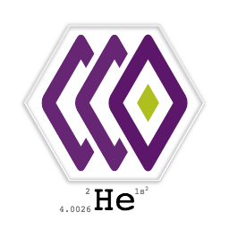
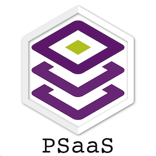

# Helium Team Logo

Looks like a __Video Watermark__, feels like a __Job Queue__ 8-).

Lovingly handcrafted in SVG. Just for fun.


Link to: [_static website to show the logo_](https://helium-logo.netlify.com/)
Previously aliased to https://logo.he.ir-si.com/
<center>


</center>

## Deploy to Netlify
```
brew tap netlify/netlifyctl
brew install netlifyctl

## netlify.toml contains site-id, --base-directory is not stored there yet
netlifyctl deploy -b public
```

## Rasterized in Chrome (1024px,256px)
```
http-server . &
open http://0.0.0.0:8080/rasterize.html
fg
```
## Gitlab Pages and favicons
This is how we generated the favicon (all platform/mobile flavors)
- [Favicon Generator](http://realfavicongenerator.net/)
  - Set `/icons` as path.
  - Also has a node module: `npm install -g cli-real-favicon`
- Use gitlab Pages to show the logo(s) and favicons
  - [Deployed with Gitlab Pages](http://helium.gitlab-pages.hdc.engineering.intra/helium-logo), but not accessible..network issues most likely
- Also published to netlify
  - [Our domain, with ssl](https://logo.he.ir-si.com/)
  - [Netlify domain name](https://helium-logo.netlify.com/)
```
http-server public &
open http://0.0.0.0:8080/
fg
```
## Colors
Irdeto [brand guidelines](http://irdeto.com/brand-guidelines/brand-guidelines.html)

- Irdeto Purple

        HEX #5D176A
        RGB 93R.23G.106B
        CMYK 66C.100M.8Y.27K
        PMS 260 C

- Irdeto Green

        HEX #AEBF1E
        RGB 174R.191G.30B
        CMYK 25C.0M.100Y.15K
        PMS 583 C

## Prior Art
_Adapted from artwork I did for PSaaS.._

<div style="background-color:#fff;border-radius: 10px; display:inline-block; padding:10px">

</div>


Check the math in `PSaaS/WIP/losange.svg`


